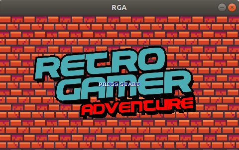
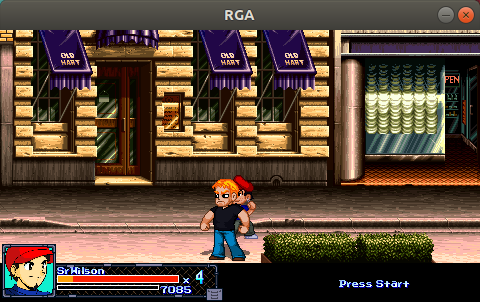
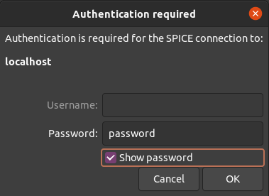
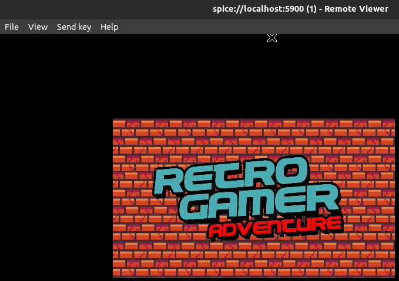

# OpenBOR-linux


# Requirements

* docker

# Build & Make

```
DOCKER_DEFAULT_PLATFORM=linux/amd64 make build
docker run -ti -v $(pwd)/shared:/home/openbor/shared openbor-linux
```

ELF Generated file

```
file shared/OpenBOR/OpenBOR
```

```
shared/OpenBOR/OpenBOR: ELF 64-bit LSB shared object, x86-64, version 1 (SYSV), dynamically linked, interpreter /lib64/ld-linux-x86-64.so.2, for GNU/Linux 3.2.0, BuildID[sha1]=1712d2f64eca30dd92ed4e58112502199c4985b9, stripped
```


# Download Demo

```
docker run -ti -v $(pwd)/shared:/home/openbor/shared openbor-linux
download-demo
exit
```

# Play

Outside of container

```
cd $(pwd)/shared/OpenBOR
./OpenBOR
```







Or vnc/spice

```
make run
```


The password is `password`



# References

* [OpenBOR repository](https://github.com/DCurrent/openbor)

* [Retro Gamer Advanture](http://www.zvitor.com.br/projeto/rga.html)
